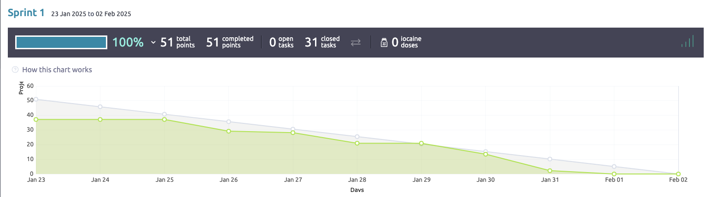

# Sprint Documentation Template

> **Important:** Ensure all fields are filled out in a clear and structured manner. Please use the format as shown below.
> For questions, use **blockquotes** and provide detailed explanations where required. 

Make sure you refer to the [Kickoff Document](#) for additional details and guidelines. 

---

## 1: Basic Information

### Project Information:
- **Topic Chosen**: Topic 3
- **Sprint Number**: 1
- **Scrum Master**: Jedi
- **Git Master**: Edwin

### Sprint Planning (For Sprint 1-3):
Fill out your Sprint Planning here, based on the kickoff document and your team's discussions.

#### Sprint Goal:
- **Sprint Goal**: Fix bugs, and enhance memoranda to get ready for Taiga API implementation in sprint 2.

#### Product Backlog & Sprint Backlog:
- **User Stories in Product Backlog**: 8
- **User Stories in Sprint Backlog**: 13
  > - US#1: As a user I want the program to exit correctly when I click on the "x" or Exit in the File menu so I can exit the program without it staying open in the background.
  > - US#2: As a user I want the splash screen and the title of the program to show a new logo and name, so that I know which software is opened and what it is for.
  > - US#3: As a user I want the program to minimize correctly so the program can be reopened without re-launching the entire program.
  > - US#4: As a user I want the symbols/language (English) to display correctly so that I can understand the UI and it is consistent.
  > - US#5: As a user I want Look and Feel in the preferences removed or changed so that it is not confusing and inconsistent anymore.
  > - US#6: As a User I would like the UI to represent the system you chose better so I understand the functionality options better.
  > - US#7: As a user I'd like for the icons on the left side panel to match what the program is supposed to do so that I can navigate the program better.
  > - US#8: As a developer I want to reverse engineer Memoranda to better understand the dependencies
  > - US#9: As a developer I want no warnings showing up when running Memoranda so that things run cleanly.
  > - US#28 As a user I want to be able to access information about a sprint so that I can view # of US's, when they were moved to sprint, how many tasks where created, what got done and did not, were the tasks moved correctly, and who worked on which tasks.
  > - US#34: As a user I want to be able to login to Taiga so that I can access its functions.
  > - US#47: As a developer I want to be able to use the same client object in multiple classes so that I am using the same instance.
  > - US#50: As a user I want to be able to sign out so that my token cannot be used.
  
**Go to [Taiga Backlog](https://tree.taiga.io/project/amehlhase316-ruebezahl_spring25a/backlog) to view the rest

#### Sprint Planning Questions:
- **Why did you select these User Stories for this Sprint?**
    > 9 were provided and the one that was added was to create a functional user interface to be able to interact with the API implemented in Sprint 2+.
  > Our team added three US's late in the Sprint due to our pace.

 #### Sprint Planning Questions:
- **Why do you think you can complete them in this Sprint?**
    > 8 of these tasks are a light load and the 2 that are not have enough tasks to be spread throughout the team.

- **How do these User Stories align with the Sprint Goal?**
    > They all enhance the user experience by fixing bugs, improving the UI and put the team in a position to implement API features in sprint 2+.

- **Do you have a clear idea of the tasks needed to complete these User Stories? (If not, please notify via Slack.)**
    > For this Sprint US5 is ambiguous need to read out to PO to get a better understanding, however there are some nuances
  > that will need to be ironed out for some US's in the PB.

---

## 2: During the Sprint

> Keep this section updated regularly with your meeting minutes, progress, and reflections. This will also assist you with your retrospective and contributions.

### Meeting Minutes (Daily Scrum):
Track meeting notes and progress. Fill in the table below during each Daily Scrum meeting.

| **Date**   | **Who Did Not Attend** | **Meeting Notes**                                                                   | **Burndown Status** (Sprint 2 onwards) | **GitHub Actions Status** (Sprint 4 onwards) | **Additional Notes**|
|------------|------------------------|-------------------------------------------------------------------------------------|----------------------------------------|---------------------------------------------|----------------------|
| _1/20/2025_| _Noel Trujillo_        | _Discuss group assignment, vote for Scrum and Git Master, vote for topic_           | _On track/Behind/Ahead_                | _Pass/Fail_                                 | _Other relevant info_ |
| _1/24/2025_| _Noel Trujillo_        | _10 US, discuss US, tasks added. Layout design discussed and approved _             | _On track/Behind/Ahead_                | _Pass/Fail_                                 | _Other relevant info_ |
| _1/24/2025_|                        | _Status update, 3 task not assigned. Mohammed and Noel do not have tasks_           | _On track/Behind/Ahead_                | _Pass/Fail_                                 | _Other relevant info_ |
|            |                        | _Every member updated their progress, Mohammed and Noel will select tasks today_    |                                        |                                             |                       |
|            |                        | _Three tasks left unnasigned, we might have to create more task or USs to meet req. |                                        |                                             |                       | 
|_1/27/2025_ | _Noel Trujillo_        | _US50 and US28 added_                                                               |                                        | _Pass/Fail_                                 |                       | 
|_1/30/2025_ | _Noel Trujillo_        | _US7 has version 2 of the project, will be pushed during the second sprint.         | _On track/Behind/Ahead_                |                                             |                       |     |            |                        |                                                                                     |                                        |                                             |                       |
|_2/02/2025_ |                        | Spoke about sprint retrospective and review. Jedi will be working on the video      | _On track/Behind/Ahead_                | _Pass/Fail_                                 | _Other relevant info_ |
|            |                        | All members have to update their contributions and notify Jedi for the video.       |                                        |                                             |                       |
|            |                        | Next meeeting will be on 05FEB2024, pre-sprint meeting to discuss expectations.     |                                        |                                             |                       |
|_Date_      |                        |                                                                                     | _On track/Behind/Ahead_                | _Pass/Fail_                                 | _Other relevant info_ |

## 3: After the Sprint

### Sprint Review (Answer as a team)
#### Screen Cast Link:  
[Youtube Screencast](https://youtu.be/NsqnT2WaA4Y)

#### Sprint Review Questions:
- **What value did you create during this Sprint?**
    > We established a link between the UI and the Taiga API. This creates value
  > because the token allows a user to be able to request
  > information on projects, US's, tasks, metadata on all of those, stats on
  > on the Scrum, and other calls. 

- **Do you feel you worked enough and met expectations?**
    > Everyone put in work on the sprint and tasks. There was a bit of a skill gap between some due to API's being novel, 
  > but those who had worked with them produced resources to help others learn the basics and replicate these calls
  > on postman or boomerang. We will work to close this gap as the expectations will be higher in sprint 2 being heavy
  > in the API calls and parsing the JSON data.

- **Did you meet the customers’ expectations? Why or why not?**
    > We met the minimum standard for out v1.0 release. 
  > We fixed all the bugs that were causing issues with functionality and introduced some new ones.
  >  Having done a complete UI overhaul to better line up with the core
  > functionality of the app, further development is needed. 

---

### Sprint Retrospective (Answer as a team, based on evidence)
Provide clear answers based on your team’s actual data and performance.

- **Did you meet your Sprint Goal?**

_**Sprint Goal**: Fix bugs, and enhance memoranda to get ready for Taiga API implementation in sprint 2._
  > We fixed all the bugs in the original code from the minimize window, close window, deprecation warnings, LAF,
  > preferences window not appearing, broken links and more. All of this enhanced the overall function and feel of the 
  > application for the customer. We also added functionality for the Taiga API for login, Projects and User stories.
  
- **Did you complete all User Stories in the Sprint Backlog?**
    > Yes, all ten original US's were complete in addition to the 3 added later in Sprint.
> 1. US1 window closes when the "x" is pressed without the process continuing. [Commit]()
> 2. US2 Splash screen has been changed.[Commit]()
> 3. US3 window now minimizes to the taskbar without disappearing. [Commit]()
> 4. US4 resolved translation issues successfully. 4 commits in total that were implemented during PR2 https://github.com/amehlhase316/Ruebezahl_spring25A/pull/2
> 5. US5 Look and feel was deleted from preferences and added to top menu as "Theme" [Commit 20310ae](https://github.com/amehlhase316/Ruebezahl_spring25A/commit/20310aea31f5f5d6195536957c840c61bd99c20e)
> 6. US6 UI has been overhauled. Useless classes were deleted. [Commit 79f3815](https://github.com/amehlhase316/Ruebezahl_spring25A/commit/79f381537e6d980068423b46a9a8044ebf5960cb)
> 7. US7 Left side icons reflect functionality. [Commit]()
> 8. US8 UML document drafted for most important classes. 1 commit total implemented. https://github.com/amehlhase316/Ruebezahl_spring25A/commit/95a614a2c1b26935149639ee5fa2c9c06a682b16
> 9. US9 All deprecation warnings fixed. A few xLint warnings still appear due to old libraries used with old gradle build. [Commit 1445dbf](https://github.com/amehlhase316/Ruebezahl_spring25A/commit/1445dbf9f3001f69cbc02b74b69fa61a12a1e29f)
> 10. US28 Api implemented that pulls all data for the US's and prints to the console. Need to build UI to display information[Commit 2ed9e41](https://github.com/amehlhase316/Ruebezahl_spring25A/commit/2ed9e4161689d0a2323916f6695c9baec1eec356)
> 11. US34 Authenticate and TaigaLoginDialog classes implemented and operational. [Commit f9b6cad](https://github.com/amehlhase316/Ruebezahl_spring25A/commit/f9b6cad269cd8d1723ced8f10c96bb1cb196485b)
> 12. US47 use a singleton object to pass into UI components. Same instance used program wide.[Commit 2127478](https://github.com/amehlhase316/Ruebezahl_spring25A/commit/2127478993551f7a68c0c9a36ccdb7c60523f693)
> 13. US50 upon sign-out auth and refresh tokens assigned to NULL. [Commit]()

- **If not, what went wrong?**
    > All tasks and accompanying US's were completed from the sprint backlog.

- **Did you work at a consistent rate or velocity?**
    > This chart shows a near linear progression.

- **Did you deliver business value and what was it?**
    > By being able to establish a connection via API the user will now be able to access
  > a vast swath of information. Further API implementation in the UI will be the focus for Sprint 2. Integrating 
  > API into a customer app gives the ability to tailor a custom experience that the Taiga
  > website interface can't replicate. There is much more data in the JSON responses than are
  > available through the web interface.

- **Did you follow the Scrum process (e.g., moving tasks, updating boards, etc.)?**
    > We did as best we could. There were a few tasks left in limbo due to a team member withdrawing
  > from the course that were worked on in different branches anticipating as much due to the lack of
  > communication. Testing and CR's were a light during this Sprint and for Sprint 2+ we plan on doing 
  > PR's and Cr's for all merges into dev after a US is finished. We will update the quality policy accordingly.

- **Is there anything you could improve for the next Sprint? (For the last Sprint mention what you would do if you were to continue)**
    > Squashing and amending commits before pushing, increased CR's and PR's, adding BB and WB testing for the API calls, testing of
  > UI features, better design meetings, standup meetings that are more substantive, less sloppy management
  > of large changes in the app (force pushing to overwrite dev), develop a better way to track commits and progress
  > , and come up with a testing plan and expectations. Additionally, we need to add more of our important communication
  > to Slack. We have been doing the vast majority of our communication on Discord where we host our meetings. For sprint 2+ we will 
  > request CR's and post PR's in the git channel on slack in addition to discord for better tracking.

- **How do you feel about the Sprint? (Team optimism pulse)**
    > There is ample room for improvement at all levels. The most important thing will be to get
  > everyone spun up on the use of API's, teach everyone how to extract information from a JSON response 
  > ensure proper tests are written, proper error/exception handling, and to get more balanced contribution from
  > all team members. Overall, we are in a good place moving into Sprint 2 and feel confident that we can deliver a 
  > useful product.

---

### Burndown Chart (For Sprint 2 and 3):
Please include a screenshot of your Burndown chart here, and provide a detailed analysis. 
- **Analysis of Burndown**: _Why does it look like this? What would you improve?_
  
> _Your Answer_

---

## 4: Contributions (Document each team member’s contributions for the Sprint)

> This section should be filled out by each team member. Below is the structure for how each team member will describe their contributions.
> You may copy and paste the template below for each person.

### Team Member [Jedi]

#### Consistency and Effort:
- **Did you work consistently and contribute enough to the project?**
    > Yes, I completed the most tasks, hosted meetings. Debugged and tested other peoples code.
  > Was lead on overhauling the UI for the unreleased v2.0. Coordinated design talks and the standup meetings.
  > Taught others how to make the api calls (WIP) Populated the Scrumboard, product backlog with additional
  > US's, AC's, and tasks. 

- **What business value did you deliver personally?**
    > I worked with Karl to create the initial api authorization token with Karl. He created the UI and I worked on 
  > the backend implementation of the TaigaClient. I would later work on the API modules (Projects and User Story) and models which will be instrumental
  > in the future sprints. I also worked on a UI overhaul that modernized the app and deleted the antiquated functionality of the
  > app. This will be viewable on the dev branch. 
### Team Member [Jimmy]

#### Consistency and Effort:
- **Did you work consistently and contribute enough to the project?**
  > I personally think I worked consistently and contributed enough for the project; I spent time trying to understand 
  > the logic of how the memoranda software works and consulted my team members about features/functions that we deemed 
  > not important towards our grand goal of implementing the Taiga API into the software. At first, I attempted to fix the 
  > features to make it more usable, but it seems that the logic is either faulty or there are issues with JavaFX that make 
  > it simply impossible to fit the functions we want. This led me to push for the removal of the resource tab as well as 
  > associated functions related to this feature allowing me to sift through the code and remove it without the introduction
  > of any bugs or faults.

- **What business value did you deliver personally?**
  > I believe that by removing files and features that aren't desired or needed anymore and taking the time to remove all
  > aspects of it including pngs and calls makes troubleshooting in the future much easier since if we simply made it
  > functional by disabling the feature instead of deleting it and an engineer were to do a code review over an unrelated
  > bug/feature, then they would potentially waste tons of time sifting through useless code that should really be not be
  > there in the first place.

### Team Member [Edwin]

#### Consistency and Effort:
- **Did you work consistently and contribute enough to the project?**
  > Yes, I worked on the spanish to english translations as well as created the UML document for the most important classes.
  > I consistently contributed and was present during all meetings and communications. However, I also understand and recognize
  > that some team members contributed more. To increase my contribution, I have been working towards understanding how to use
  > other tools to implement APIs as well as how to correctly read and understand an API, so I can contribute more effectively to the group.

- **What business value did you deliver personally?**
  > At first, I resolved the translation issues, improving the code's readability and consistency. Additionally, I created UML
  > diagrams to illustrate how each class interacts, enhancing overall understanding of the system's architecture.
### Team Member [Karl]

#### Consistency and Effort:
- **Did you work consistently and contribute enough to the project?**
  > Yes, in the early days of the sprint I fixed the pathing issues for the preference dialog box and the exit functionality.
  > I worked with Jedi to implement the UI for the Taiga login and linked the backend and frontend, ensuring that both sides
  > work correctly, in tandem. Additionally, I implemented the Taiga profile panel UI, linked it with the backend,
  > and implemented some refresh functions to ensure that the user's information populates and auto-updates for when
  > the users log-in, although, this is still a work in progress.

- **What business value did you deliver personally?**
  > The application now exits correctly and the preference dialog box now opens without crashing the program. With the
  > log-in dialog box implemented, users may now be able to log in to the application using their Taiga credentials.
  > Finally, with the user profile panel implemented, users can now observe their Taiga information populate into their 
  > profile panel with their full name, username, and email.
### Team Member [Andrew]

#### Consistency and Effort:
- **Did you work consistently and contribute enough to the project?**
  > My work involved designing the new app splash screen and updating the code to integrate it at launch.
  > I also located and reviewed the existing app logo, making edits to adapt the logo screen image for potential
  > future updates in the 'About' section. During that process, I noticed the code still referenced the old app
  > name, logo, and the previous developers names. But considering these changes were outside the project scope,
  > I still made the initiative to prepare a new logo for future updates, ensuring a smoother transition when
  > its time to make those changes. 

- **What business value did you deliver personally?**
  > The program's launch experience was completely revamped with a new splash screen ensuring users immediately
  > recognize the significant changes made to the application. This update helps signal the trandstion from the
  > previous version, prompting users to explore and familiarize themselves with the new potential functionality
### Team Member [Mohammed]

#### Consistency and Effort:
- **Did you work consistently and contribute enough to the project?**
  > I believe I worked consistently throughout the project. I ensured that the icon changes on the left side panel
  > were implemented correctly and aligned with the functionality of the program. I paid close attention to detail,
  > making sure that each icon represented its function, improving user navigation. Also, I worked with the team to
  > get feedback and make necessary adjustments.

- **What business value did you deliver personally?**
  > By updating the icons to match functionalities, I enhanced the user experience by making the navigation user
  > friendly. This reduces confusion and increases efficiency for users interacting with the program. 

#### GitHub Links to Work:
Please provide the links to your key contributions on GitHub. Include **commits, pull requests**, and other important work items.

- **GitHub Commits (Up to 5)**
    - [Commit 1](https://github.com/amehlhase316/Ruebezahl_spring25A/pull/2/commits/702f21e5b719445754465ce9c783980ea2c66d77) - Addressed translation issues in the ExportSticker class at lines 72 and 77.  
    - [Commit 2](https://github.com/amehlhase316/Ruebezahl_spring25A/commit/79f381537e6d980068423b46a9a8044ebf5960cb) - Overhaul the entire app to match topic functionality
    - [Commit 3](https://github.com/amehlhase316/Ruebezahl_spring25A/commit/f44865dfd89b3152d6457dd9a1a79c53974bb764) – Changed left side panel icons.
    - [Commit 4](https://github.com/amehlhase316/Ruebezahl_spring25A/commit/17edaa7c8ebccba6176c8f361c36193e841e6a54) - Updated logo and splash screen images that were included. Code change in later earlier commit
    - [Commit 5](https://github.com/amehlhase316/Ruebezahl_spring25A/commit/0f969f68e587fe86b7af1ecd0a40e910704ce134) - Removed Resource Button and all files that were related to this feature.
- **GitHub Pull Requests (Up to 3)**
    - [PR 1](https://github.com/amehlhase316/Ruebezahl_spring25A/pull/2) 
      -  This pull request merges updates from the jdlafond individual branch into the master branch. The updates address multiple areas including: fix translations 
                                                                                issues, fix deprecated features, updated documentation and additional improvements accrosss memoranda. In total, 28 commmits were made, ensuring improved 
                                                                                functionality, better maintainability, and code quality. 
    - [PR 2](https://github.com/amehlhase316/Ruebezahl_spring25A/pull/7) 
      -  This pull request merges the lastest changes from the dev branch into master. It contains 182 commits with significant changes to code funtionality in which
                                                                                341 fiels were modified to accomodate for the implementation of the Taiga API. This code is the final version completed after Sprint 1 with all features and
                                                                                improvements delineated on the User Stories for this sprint. 
- **GitHub Unit Tests (Up to 3, start in Sprint 2)**
   

- **Code Reviews (Up to 3, start in Sprint 2)**
   

- **Static Analysis Contributions (Start in Sprint 3)**
    - [Static Analysis 1](link) - _Short description of the analysis contribution_
    - [Static Analysis 2](link) - _Short description of the analysis contribution_

---

## 5: Sprint Completion Checklist (optional)

Before submitting your Sprint deliverables, make sure to check the following items:

- [ ] This document is complete and well-formatted.
- [X] Your software is on the master branch on GitHub, it is tested and compiles/runs.
- [ ] Your document is on your GitHub repository.
- [ ] Read the Kickoff Document again to ensure you followed all instructions.
- [ ] User Stories that were not completed have been moved to the next Sprint’s backlog.
- [ ] Quality Policies are up-to-date and accurate.
- [ ] Individual Sprint Surveys have been submitted (one per team member).
  - [ ] Team member Jedi
  - [X] Team member Edwin
  - [ ] Team member Karl
  - [ ] Team member Jimmy
  - [ ] Team member Andrew
  - [X] Team member Mohammed
- [ ] The original template has been copied for the next Sprint (except for the last Sprint).
- [ ] New User Stories for the next Sprint are added and well-defined.

#### For the next Sprint:
- [ ] New User Stories have acceptance tests and initial tasks.
- [ ] The Taiga board is up-to-date.
- [ ] Tasks for the next Sprint are clearly defined.

---

### Additional Notes:
- Please ensure that the links are clickable and lead directly to relevant content.
- Double-check formatting to ensure easy readability and grading.

