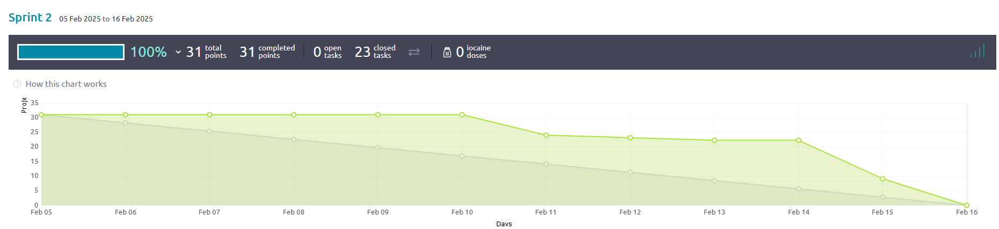
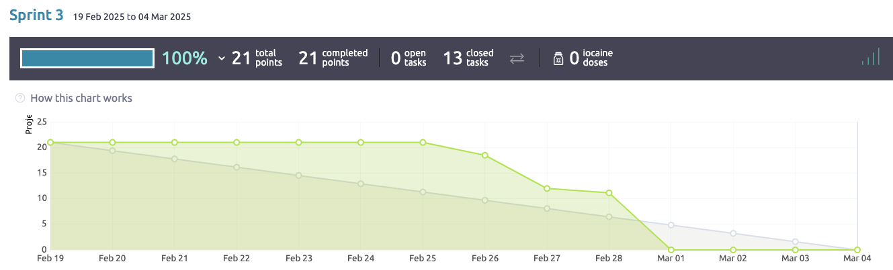

# Sprint Documentation Template

> **Important:** Ensure all fields are filled out in a clear and structured manner. Please use the format as shown below. For questions, use **blockquotes** and provide detailed explanations where required. 

Make sure you refer to the [Kickoff Document](#) for additional details and guidelines. 

---

## 1: Basic Information (To be completed before you start Sprint)

### Project Information:
- **Topic Chosen**: Topic 3
- **Sprint Number**: 3
- **Scrum Master**: Jimmy
- **Git Master**: Jedi

### Sprint Planning (For Sprint 1-3):
Fill out your Sprint Planning here, based on the kickoff document and your team's discussions.

#### Sprint Goal:
- **Sprint Goal**: 
> Clear the rest of the US's out of the backlog and add design patterns to make the app dynamic.

#### Product Backlog & Sprint Backlog:
- **User Stories in Product Backlog**: 0
- **User Stories in Sprint Backlog**: 4

#### Sprint Planning Questions:
- **Why did you select these User Stories for this Sprint?**
    > To add last touches on the UI and these were the last US's leftover in the product backlog.

 #### Sprint Planning Questions:
- **Why do you think you can complete them in this Sprint?**
    > Yes, the bulk of the work was completed in the former sprints. This sprint was mainly to polish UI and add 
  > functionality to the issues section.

- **How do these User Stories align with the Sprint Goal?**
    > Adding an observer allows the app to be dynamic and update the state while using the app. Adding the sprint 
  > interface, see and manage issues.

- **Do you have a clear idea of the tasks needed to complete these User Stories? (If not, please notify via Slack.)**
    > Yes. We are creating a beta app that mirrors the functionality of the Taiga website.

---

## 2: During the Sprint

> Keep this section updated regularly with your meeting minutes, progress, and reflections. This will also assist you with your retrospective and contributions.

### Meeting Minutes (Daily Scrum):
Track meeting notes and progress. Fill in the table below during each Daily Scrum meeting.

| **Date**   | **Who Did Not Attend** | **Meeting Notes**                                             | **Burndown Status** (Sprint 2 onwards) | **GitHub Actions Status** (Sprint 4 onwards) | **Additional Notes** |
|------------|------------------------|---------------------------------------------------------------|----------------------------------------|----------------------------------------------|----------------------|
| 02/19/2025 | Everyone was present   | Sprint planning and creating tasks for User Stories_          | On track                               | Pass/Fail                                    | 10 minutes           |
| 02/24/2025 | Everyone was present   | Scrum Meeting                                                 | On track                               | Pass/Fail                                    | 10 minutes           |
| 02/28/2025 | Mohammed               | Scrum Meeting                                                 | On track                               | Pass/Fail                                    | 10 minutes           |
| 03/02/2025 | Everyone was present   | Scrum Meeting                                                 | On track                               | Pass/Fail                                    | 10 minutes           |
| 03/04/2025 | Everyone was present   | Sprint closing, deliverable contributions, final PR to master | On track                               | Pass/Fail                                    | 10 minutes           |
---

## 3: After the Sprint

### Sprint Review (Answer as a team)
#### Screen Cast Link:  
- [Youtube Link] (https://youtu.be/Wwl1jytSGUc)

#### Sprint Review Questions:
- **What value did you create during this Sprint?**
> We made the application dynamic, added support for the burndown chart, created a sprint interface and an issues
> interface to allow the end user to interact with the application.

- **Do you feel you worked enough and met expectations?**
> Yes, we met the sprint goal and created an application that looks and feels nothing like the original memoranda app.
> it has completely evolved into a usable application.

- **Did you meet the customers’ expectations? Why or why not?**
> If the customer wanted an application to work on team planning and sprint related tasks, then yes. For one scrum round,
> our team accomplished just that. Given more time the application could be refined but this is a beta ready application.

---

### Sprint Retrospective (Answer as a team, based on evidence)
Provide clear answers based on your team’s actual data and performance.

- **Did you meet your Sprint Goal?**
> Sprint goal: Clear the rest of the US's out of the backlog and add design patterns to make the app dynamic.
> Yes, we cleared out the backlog and got the application ready for a beta launch.

- **Did you complete all User Stories in the Sprint Backlog?**
> Yes, see burndown chart and product backlog.

- **If not, what went wrong?**
> We completed our goal but the unit testing and CR's were lacking. Poor QualityPolicy control by not submitting PR's of other branches into dev.

- **Did you work at a consistent rate or velocity?**
> 27 tasks (25 completed, 2 remaining) 27 and counting commits for sprint 3. See burndown chart below.
- **Did you deliver business value and what was it?**
> The application is beta ready for a soft launch. We tested as much as we could. Now it is ready for the end user to use it and provide feedback.

- **Did you follow the Scrum process (e.g., moving tasks, updating boards, etc.)?**
> Yes, boards were reviewed and updated each meeting. The team talked about obstacles and plans to overcome them. Collaboration was ample for those that attended meetings.

- **Is there anything you could improve for the next Sprint? (For the last Sprint mention what you would do if you were to continue)**
> Soft launch the app and get user/customer feedback. Use that to plan the next course of action.

- **How do you feel about the Sprint? (Team optimism pulse)**
> Glad this is the last sprint. 

---

### Burndown Chart (For Sprint 2 and 3):
Please include a screenshot of your Burndown chart here, and provide a detailed analysis. 
- **Analysis of Burndown**: _Why does it look like this? What would you improve?_

> Again this round was slowed down due to the implementation of a complex task that others were waiting on. Once the observer design pattern was 
> implemented the rest of the task quickly followed. What could have been improved is having tasks broken down into smaller
> more manageable pieces, enabling team members to complete and update progress continuously throughout the sprint. This
> is shown by the high starting points with and the sharp drop near the end. 

---

## 4: Contributions (Document each team member’s contributions for the Sprint)

> This section should be filled out by each team member. Below is the structure for how each team member 
> will describe their contributions. You may copy and paste the template below for each person.

### Team Member [Andrew]

#### Consistency and Effort:
- **Did you work consistently and contribute enough to the project?**
> I worked on the screencast, so essentially going through the leftover USs in the sprint then matching that up 
> to all the commits and changes in code, then try to speak the best I can about it. 

- **What business value did you deliver personally?**
> zero in sprint 3 unless the screencast counts. 

### Team Member [Edwin]

#### Consistency and Effort:
- **Did you work consistently and contribute enough to the project?**
  > I worked on US30 task 86 implementing the correct calls to ensure that the backlog information from taiga displays
  > correctly. With the help of Jedi, I was able to make it so that the backlog of all active projects show on the backlog page. 

- **What business value did you deliver personally?**
  > Yes, by implementing the correct calls to fetch and display backlog information from Taiga, I ensured that users can easily access the backlog for all active projects.
  > This improves workflow visibility, enhances project tracking, and helps teams prioritize tasks efficiently. Additionally, by working with Jedi, I contributed to a more \
  > robust and accurate backlog display, reducing potential data inconsistencies and improving the overall usability of the backlog page.

### Team Member [Jedi]

#### Consistency and Effort:
- **Did you work consistently and contribute enough to the project?**
> Yes, I worked as much as time permitted. Once I was comfortable with the design pattern to enable dynamic loading and updating 
> I began working on it. Once enabled this pattern allows the application to load and display updated information when a 
> API call is made.

- **What business value did you deliver personally?**
> Having a dynamic application is the minimum requirement that is needed to be beta. If everytime the user
> had to close the app and reopen it to show change no person on earth would waste their time with this app. 
> This creates business value by making it viable to be released as a beta where users can suggest improvements and 
> features. 

### Team Member [Jimmy]

#### Consistency and Effort:
- **Did you work consistently and contribute enough to the project?**
  > I worked on US32 task87 using some new imports to help populate the application with a chart that shows our sprint progress and
  >  many points were completed. While I had to learn some additional documentation and tools on how to implement graphs, I feel as 
  > if it were a nice touch to wrap everything up.

- **What business value did you deliver personally?**
  > I believe that having an application that can show different representations of data such as sprint progress is pretty helpful 
  > in the grand scheme of things since people have multiple ways of interpreting data and having something helpful such as that chart
  > can show other team members if the team is operating in a productive fashion.

### Team Member [Karl]

#### Consistency and Effort:
- **Did you work consistently and contribute enough to the project?**
  > _Your Answer_

- **What business value did you deliver personally?**
  > _Your Answer_

### Team Member [Mohammed]

#### Consistency and Effort:
- **Did you work consistently and contribute enough to the project?**
  > _Your Answer_

- **What business value did you deliver personally?**
  > _Your Answer_

#### GitHub Links to Work:
Please provide the links to your key contributions, on GitHub. Include **commits, pull requests**, and other important work items.

### Team Member [Andrew]
- **GitHub Commits (Up to 5)**
    - [Commit 1](link) - _Short description of what the commit is about_
    - [Commit 2](link) - _Short description of what the commit is about_
    - [Commit 2](link) - _Short description of what the commit is about_

- **GitHub Pull Requests (Up to 3)**
    - [PR 1](link) - _Short description of the PR_
    - [PR 2](link) - _Short description of the PR_

- **GitHub Unit Tests (Up to 3, start in Sprint 2)**
    - [Test 1](link) - _Short description of the test_
    - [Test 2](link) - _Short description of the test_

- **Code Reviews (Up to 3, start in Sprint 2)**
    - [Review 1](link) - _Short description of the code review_
    - [Review 2](link) - _Short description of the code review_

- **Static Analysis Contributions (Start in Sprint 3)**
    - [Static Analysis 1](link) - _Short description of the analysis contribution_
    - [Static Analysis 2](link) - _Short description of the analysis contribution_

### Team Member [Edwin]
- **GitHub Commits (Up to 5)**
  - [[Commit 1](https://github.com/amehlhase316/Ruebezahl_spring25A/commit/0b34208445f30ad590dce9b3da1cb5cd9c905305)] - US30 Task86 Added calls to correctly display the Backlog from Taiga.
  - [[Commit 2](https://github.com/amehlhase316/Ruebezahl_spring25A/commit/5172d931941d294d454f90b748818a38e8514589)] - US30 Task86 Added a try / catch to the calls to correctly display the Backlog from Taiga.

- **GitHub Pull Requests (Up to 3)**
  - [PR 1](link) - _Short description of the PR_
  - [PR 2](link) - _Short description of the PR_

- **GitHub Unit Tests (Up to 3, start in Sprint 2)**
  - [[Test 1](https://github.com/amehlhase316/Ruebezahl_spring25A/actions/runs/13558473901/job/37897220874)]- JUnit Test for Commit 5172d93, it failed due to payment issues. 
  - [[Test 2](https://github.com/amehlhase316/Ruebezahl_spring25A/actions/runs/13557231793/job/37893781322)]- JUnit Test for Commit 0b34208, it failed due to payment issues. 

- **Code Reviews (Up to 3, start in Sprint 2)**
  - [[Review 1](https://github.com/amehlhase316/Ruebezahl_spring25A/commit/8be0e77e24112e02859a82e371336819420faf0d)] - Code review for PR to merge dev into Master. 
  - [Review 2](link) - _Short description of the code review_

- **Static Analysis Contributions (Start in Sprint 3)**
  - [[Static Analysis 1](https://github.com/amehlhase316/Ruebezahl_spring25A/actions/runs/13558473907/job/37897221079)]- Static Analysis for Commit 5172d93, it failed due to payment issues. 
  - [[[Static Analysis 2](https://github.com/amehlhase316/Ruebezahl_spring25A/actions/runs/13557231798/job/37893781320)]- Static Analysis for Commit 0b34208, it failed due to payment issues. 

### Team Member [Jedi]
- **GitHub Commits (Up to 5)**
  - [US85](https://github.com/amehlhase316/Ruebezahl_spring25A/tree/2c32bf5f26afb6872718525b0e2b1e1016f22e07) - US85 completion
  - [US85 subtasks](https://github.com/amehlhase316/Ruebezahl_spring25A/tree/ce0c028fb3f434cba11bd1cedae96d858d7d9d86) - US85 subtasks
  - [US81](https://github.com/amehlhase316/Ruebezahl_spring25A/commit/1432733908854a9a332b99669e0bf5aa09629890) - US81 refactoring help

- **GitHub Pull Requests (Up to 3)**
  - [PR 1](https://github.com/amehlhase316/Ruebezahl_spring25A/pull/23/commits) - Pull dev into master post sprint 3
  

- **GitHub Unit Tests (Up to 3, start in Sprint 2)**
  - [Test 1](https://github.com/amehlhase316/Ruebezahl_spring25A/blob/dev/src/test/java/memoranda/taiga/CreateProjectTest.java) - Create Project test class
  - [Test 2](https://github.com/amehlhase316/Ruebezahl_spring25A/blob/dev/src/test/java/memoranda/taiga/InviteTest.java) - InviteTest class

- **Code Reviews (Up to 3, start in Sprint 2)**
  - [Review 1](https://github.com/amehlhase316/Ruebezahl_spring25A/commit/bf69d839a9be8774710b4e29766f16459385be95#diff-150e47fdd13c63587d97b59676c4fe48f3866b65570b7062d6c101a80dc4a4be) - Code Review on US81 tested and refactored UI
  - [Review 2](https://github.com/amehlhase316/Ruebezahl_spring25A/pull/23) - CR for merging dev into master

- **Static Analysis Contributions (Start in Sprint 3)**
  - [Static Analysis 1](https://github.com/amehlhase316/Ruebezahl_spring25A/actions/runs/13557127504) - Failed CI 
  - [Static Analysis 2](https://github.com/amehlhase316/Ruebezahl_spring25A/actions/runs/13600015459) - Failed CI on merge

### Team Member [Jimmy]
- **GitHub Commits (Up to 5)**
  - [Commit 1](https://github.com/amehlhase316/Ruebezahl_spring25A/commit/17b0b176f17a0b3169d29b7429a5c2c43f980951) - added a chart to display our progress using points

- **GitHub Pull Requests (Up to 3)**
  - [PR 1](https://github.com/amehlhase316/Ruebezahl_spring25A/commit/1331373860b4ecfc36d5e53a68dd92e0bd97ad03) -Merged US32 into dev-

- **GitHub Unit Tests (Up to 3, start in Sprint 2)**
- - [Test 1](https://github.com/amehlhase316/Ruebezahl_spring25A/actions/runs/13598514417/job/38020435325) - JUnit Test for Commit 17b0b17, it failed due to payment issues
  - [Test 2](https://github.com/amehlhase316/Ruebezahl_spring25A/actions/runs/13601011433/job/38026826018) - JUnit Test for Commit 1331373, it failed due to payment issues.
  - [Test 3](https://github.com/amehlhase316/Ruebezahl_spring25A/actions/runs/13625890107/job/38082976005) - JUnit Test for Commit c68feeb, it failed due to payment issues.

- **Code Reviews (Up to 3, start in Sprint 2)**
  - [Review 1](https://github.com/amehlhase316/Ruebezahl_spring25A/commit/c68feeb0d77fa3b09cf25b4fbf5d60e240da8fcf) - Approved merge pull request from Us81 to dev PR.

- **Static Analysis Contributions (Start in Sprint 3)**
  - [Static Analysis 1](https://github.com/amehlhase316/Ruebezahl_spring25A/actions/runs/13598514414/job/38020435498) - Static Analysis for Commit 17b0b17, it failed due to payment issues.
  - [Static Analysis 2](https://github.com/amehlhase316/Ruebezahl_spring25A/actions/runs/13601011424/job/38026826028) - Static Analysis for Commit 1331373, it failed due to payment issues.
  - [Static Analysis 3](https://github.com/amehlhase316/Ruebezahl_spring25A/actions/runs/13625890111/job/38082976638) - Static Analysis for Commit c68feeb, it failed due to payment issues.

### Team Member [Karl]
- **GitHub Commits (Up to 5)**
  - [Commit 1](link) - _Short description of what the commit is about_
  - [Commit 2](link) - _Short description of what the commit is about_
  - [Commit 2](link) - _Short description of what the commit is about_

- **GitHub Pull Requests (Up to 3)**
  - [PR 1](link) - _Short description of the PR_
  - [PR 2](link) - _Short description of the PR_

- **GitHub Unit Tests (Up to 3, start in Sprint 2)**
  - [Test 1](link) - _Short description of the test_
  - [Test 2](link) - _Short description of the test_

- **Code Reviews (Up to 3, start in Sprint 2)**
  - [Review 1](link) - _Short description of the code review_
  - [Review 2](link) - _Short description of the code review_

- **Static Analysis Contributions (Start in Sprint 3)**
  - [Static Analysis 1](link) - _Short description of the analysis contribution_
  - [Static Analysis 2](link) - _Short description of the analysis contribution_

### Team Member [Mohammed]
- **GitHub Commits (Up to 5)**
  - [Commit 1](link) - _Short description of what the commit is about_
  - [Commit 2](link) - _Short description of what the commit is about_
  - [Commit 2](link) - _Short description of what the commit is about_

- **GitHub Pull Requests (Up to 3)**
  - [PR 1](link) - _Short description of the PR_
  - [PR 2](link) - _Short description of the PR_

- **GitHub Unit Tests (Up to 3, start in Sprint 2)**
  - [Test 1](link) - _Short description of the test_
  - [Test 2](link) - _Short description of the test_

- **Code Reviews (Up to 3, start in Sprint 2)**
  - [Review 1](link) - _Short description of the code review_
  - [Review 2](link) - _Short description of the code review_

- **Static Analysis Contributions (Start in Sprint 3)**
  - [Static Analysis 1](link) - _Short description of the analysis contribution_
  - [Static Analysis 2](link) - _Short description of the analysis contribution_
---

## 5: Sprint Completion Checklist (optional)

Before submitting your Sprint deliverables, make sure to check the following items:

- [ ] This document is complete and well-formatted.
- [X] Your software is on the master branch on GitHub, it is tested and compiles/runs.
- [X] Your document is on your GitHub repository.
- [X] Read the Kickoff Document again to ensure you followed all instructions.
- [X] User Stories that were not completed have been moved to the next Sprint’s backlog.
- [X] Quality Policies are up-to-date and accurate.
- [ ] Individual Sprint Surveys have been submitted (one per team member).
  - [ ] Team member Andrew
  - [ ] Team member Edwin
  - [X] Team member Jedi
  - [ ] Team member Jimmy
  - [ ] Team member Karl
  - [ ] Team member Mohammed
- [ ] The original template has been copied for the next Sprint (except for the last Sprint).
- [ ] New User Stories for the next Sprint are added and well-defined.

#### For the next Sprint:
- [ ] New User Stories have acceptance tests and initial tasks.
- [ ] The Taiga board is up-to-date.
- [ ] Tasks for the next Sprint are clearly defined.

---

### Additional Notes:
- Please ensure that the links are clickable and lead directly to relevant content.
- Double-check formatting to ensure easy readability and grading.

